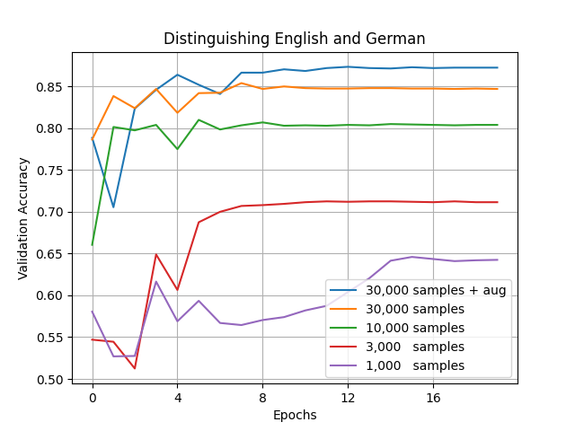

# Spoken Language Identification
A playground to test and experiment with spoken language identification. 

This code base has been developed by Hertz-Lab as part of the project [»The Intelligent Museum«](#the-intelligent-museum). 
Please raise issues, ask questions, throw in ideas or submit code as this repository is intended to be an open platform to collaboratively improve the task of spoken language identification (LID).

Copyright (c) 2021 ZKM | Karlsruhe.
BSD Simplified License.

#### Target Platform:
- Linux (tested with Ubuntu 18.04)
- MacOS (tested with 10.15)
- Windows (not tested, should be easy to fix)

## Caveats
Please take the following point into account when using our code.
- Spoken Language Identification is not a trivial problem. In order to teach a machine to perfectly recognize every small excerpt of a language you need the full spectrum of a language. This requires absurd amounts of data.
- Due to acoustical overlap of languages, the task gets harder the more languages there are to distinguish from another.
- The challenge gets even more difficult when considering different accents, ages, sex and other traits that influence the vocal tract.
- Our current model can distinguish 7 languages (and noise) with an overall accuracy of 85% on the Common Voice data set. Common Voice is a very diverse, noisy and community driven collection of spoken language. The fact that it is noisy makes it a good candidate for real world usage.
- In order to achieve our final goal of a more inclusive museum experience, we need to focus on fairness. However, as of now we haven't evaluated or mitigated bias in our system, except for appyling a gender neutral sampling approach.


## Trained Models
Our trained models can be downloaded from [this location](https://cloud.zkm.de/index.php/s/83LwnXT9xDsyxGf). All models expect 5 seconds of normalized audio sampled at 16kHz and output probabilities first for noise and then for each language in alphanumeric order. 
- AttRnn: Noise, English, French, German and Spanish.
- AttRnn7Lang: Noise, Chinese (main land), English, French, German, Italian, Spanish and Russian.
  
__Note__: these models are still subject to unbalanced training data (no oversampling) and most likely biased towards male samples. A new model is currently being prepared.

## Demonstration
If you are only interested in running the trained model then please check out our notebook in the `demo/` folder. The notebook was developed to be [run in Google Colab](https://colab.research.google.com/github/zkmkarlsruhe/language-identification/blob/main/demo/LID_demo.ipynb). It will guide you through the necessary steps to run the model in your application.

You can also check out our [OpenFrameworks demonstration](https://github.com/zkmkarlsruhe/LanguageIdentifier) which utilizes our [ofxTensorFlow2](https://github.com/zkmkarlsruhe/ofxTensorFlow2) addon.


## Results
This is a small experiment on how much data is needed to distinguish two similar languages. Here we challenged the network to separate English from German. As you can see 30,000 samples and data augmentation is still not enough for our model. With 5 seconds per sample this amounts to over 40 hours of speech data. For most languages 40 hours of training data is not available in Common Voice, yet.


## Training Setup
We highly recommend to use a (recent) GPU to train a neural network.

### Docker 

##### GPU support (recommended)
If you haven't installed docker with GPU support yet, please follow [these instructions](https://docs.nvidia.com/datacenter/cloud-native/container-toolkit/install-guide.html).

##### Building the image
Build the docker image using the [Dockerfile](Dockerfile). Make sure not to include large amounts of data into the build process (all files in the build directory are taken into account).
```shell
docker build -t lid .
```

### Local Installation
Otherwise you can install the requirements locally. This process is similar to the one in the Dockerfile.

See <https://www.tensorflow.org/install/gpu> for more information on GPU support for TensorFlow.

#### System Requirements
- ffmpeg
- sox
- portaudio
- youtube-dl (version > 2020)
- python 3
- pip 3


#### Ubuntu
Feature extraction
``` shell
sudo apt install ffmpeg sox libasound-dev portaudio19-dev
``` 
youtube-dl (version > 2020)
```shell
sudo curl -L https://yt-dl.org/downloads/latest/youtube-dl -o /usr/local/bin/youtube-dl
sudo chmod a+rx /usr/local/bin/youtube-dl
```
Python
``` shell
sudo apt install python3 python3-pip 
```

#### Python packages
```shell
pip install -r requirements.txt
```

## Dataset
This repository extracts language examples from Mozilla's open speech corpus 
[Common Voice](https://commonvoice.mozilla.org/). In order to enhance the robustness of the model against noises we use Google's audio scene dataset 
[AudioSet](https://research.google.com/audioset/dataset/index.html). 

### Download
##### Common Voice
Start by downloading language sets you are interested in. We recommend to use languages with at least 1000 speakers and 100 hours validated audio samples. Check [this site](https://commonvoice.mozilla.org/de/languages) for details.

__Note:__ In order to use our provided download script, you have to generate and copy machine-specific download links into it, as the download requires your consent.

```shell
./data/common-voice/download_common_voice.sh
```

In the end, you need a folder, referred to as `$CV_DL_DIR`, which contains subfolders for every language that you want to classify.
It may look something like this:
```
common-voice/
└──en/
└────clips/
└──────*.mp3
└────train.tsv
└────dev.tsv
└────test.tsv
└──de/
└────...
└──fa/
└────...
└──kab/
└────...
```

##### AudioSet (Optional)
In this section we will first download the AudioSet meta data file from [this website](https://research.google.com/audioset/download.html). Next, we will search it for specific labels using the provided `data/audioset/download_youtube_noise.py` script. This python script defines the labels that are relevant and those that are not allowed (human voice). With the restrictions for our use case we extracted around 18,000 samples from AudioSet. You can call the shell script like this:
```shell
YOUTUBE_DATA_DIR=yt-downloads
./data/audioset/download_yt_noise.sh $YOUTUBE_DATA_DIR
```
It will attempt to download all files to   folder that you specified in `$YOUTUBE_DATA_DIR`. Please note that some may yet be flawed as videos may not be available in your country.

__Note:__ Even with parallelization this process will likely take hours, as the script downloads the whole media file and then cuts the important part.

### Audio Extraction
We use several processing steps to form our data set from the Common Voice downloads. We recommend using the config file to define and document the processing steps. Please take a look at the CLI arguments in the script for more information on the options.
```shell
python data/common-voice/cv_to_wav.py --help
```
__Note:__ Modify the config file accordingly, e.g. replace `cv_input_dir` with `$CV_DL_DIR` and `cv_output_dir` with `$DATA_DIR` (the final dataset directory). Don't forget to name the languages in the table at the bottom.

__Note:__ audio extraction using auditok is currently broken! Please make sure `use_vad` is set to `True` in the config file. 

##### Linux
```shell
python data/common-voice/cv_to_wav.py --config data/common-voice/config_cv.yaml
```
##### Docker
```shell
docker run -d -u $(id -u):$(id -g) -v $(pwd):/work/src -v $(pwd)/../data/:/data lid python data/common-voice/cv_to_wav.py --config data/common-voice/config_cv.yaml
```

##### Add the Noise (optional)
Afterwards we check if the noise data is valid and cut and split it into the previously created `$DATA_DIR`.
Please use the provided shell script and pass it the paths to youtube data and processed speech data:
```shell
./data/audioset/process_and_split_noise.sh $YOUTUBE_DATA_DIR $DATA_DIR
```

### Preprocessing
In this version, we use [kapre](https://kapre.readthedocs.io/en/latest/) to extract the features (such as FFT or Mel-filterbanks) within the TensorFlow graph. This is especially useful in terms of portability, as we only need to pass the normalized audio to the model.

If you rather do the preprocessing separately and before training, you may want to utilize the script `data/process_wav.py` and its config file, as well as its dependant source files. In the future, we may create another branch which tackles the problem this way (as we used to do it before using kapre).


## Training
As with the creation of the dataset we use config files to define and document the process. The options we provide should sound familiar. Most importantly, modify the placeholder for the train and validation directories, as well as the languages to be detected (noise is treated as another language).

__NOTE__: Unfortunately, we still have a major issue with the data augmentation step which causes the runtime to be about 15 times more than without. We hope to address this problem in the near future.

### Docker 
The following line runs the training process inside a docker container of the newly build image. The command will grant access to the folder holding the train and test set as well as the current working directory. Make sure to run this command in the root of the project.
```shell
docker run -d -u $(id -u):$(id -g) -v $(pwd):/work/src -v $DATA_DIR:/data lid python train.py --config config_train.yaml
```
__Note__: if a GPU is available, you need to pass its ID, e.g. "--gpus device=0"

### Local installation
```
python train.py --config config_train.yaml
```

## TODO
- evaluate the fairness of the model
- report results
- fix data augmentation execution speed
- try transformer models
- try different features extractions:
  - MFCC (included in this repo)
  - [VGGish](https://tfhub.dev/google/vggish/1)
  - [Trill](https://tfhub.dev/google/nonsemantic-speech-benchmark/trill/3)
  - [YamNet](https://tfhub.dev/google/yamnet/1)
  - x-factor


## Further Reading
* Types of [Speech Features](https://haythamfayek.com/2016/04/21/speech-processing-for-machine-learning.html)
* Instead of using handcrafted speech features one could use [YamNet](https://www.tensorflow.org/tutorials/audio/transfer_learning_audio)
* We used [CRNN-LID](https://github.com/HPI-DeepLearning/crnn-lid) when we first started
* We ported the network from [this keyword-spotting code](https://github.com/douglas125/SpeechCmdRecognition)
* [VoxLingua107](http://bark.phon.ioc.ee/voxlingua107/): another multi-lingual dataset
* [Silero-VAD](https://github.com/snakers4/silero-vad): a free Voice Activity Detector and Language Identifier (en, es, de, ru)


## Contribute
Contributions are very welcome.
Create an account, clone or fork the repo, then request a push/merge.
If you find any bugs or suggestions please raise issues.


## The Intelligent Museum

An artistic-curatorial field of experimentation for deep learning and visitor participation

The [ZKM | Center for Art and Media](https://zkm.de/en) and the [Deutsches Museum Nuremberg](https://www.deutsches-museum.de/en/nuernberg/information/) cooperate with the goal of implementing an AI-supported exhibition. Together with researchers and international artists, new AI-based works of art will be realized during the next four years (2020-2023).  They will be embedded in the AI-supported exhibition in both houses. The Project „The Intelligent Museum” is funded by the Digital Culture Programme of the [Kulturstiftung des Bundes](https://www.kulturstiftung-des-bundes.de/en) (German Federal Cultural Foundation) and funded by the [Beauftragte der Bundesregierung für Kultur und Medien](https://www.bundesregierung.de/breg-de/bundesregierung/staatsministerin-fuer-kultur-und-medien) (Federal Government Commissioner for Culture and the Media).

As part of the project, digital curating will be critically examined using various approaches of digital art. Experimenting with new digital aesthetics and forms of expression enables new museum experiences and thus new ways of museum communication and visitor participation. The museum is transformed to a place of experience and critical exchange.


